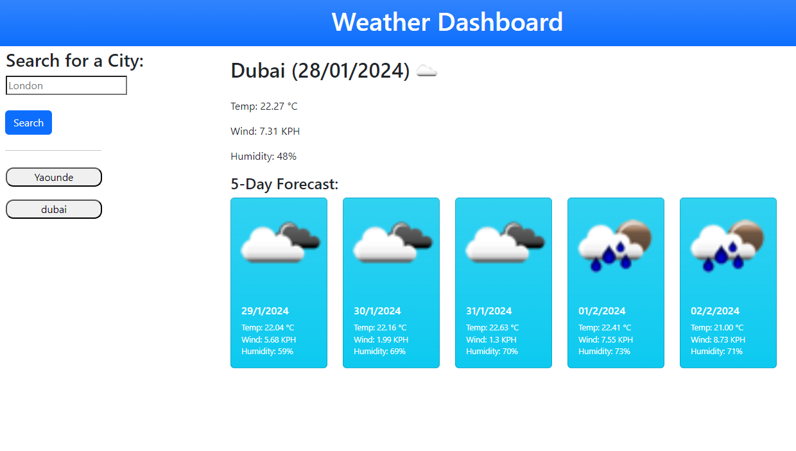

# City-Weather
Find the weather details in any city!

## Description 

This particular project is a weather app that provides live data on the temperature, the wind speed and the humidity of any city in the world. Not only for today's date, but also for the next five days to give the user enough information to plan a trip accordingly. So, make the most of this tool and have a fun and weatherproof day!

URL: https://eiteltchap.github.io/City-Weather/

## Installation

N/A

## Usage 

* Type in the city you wish to check out in the search input and click on the search button or press enter.

* You will be able to see on the right of the search bar the following info

    * The city name
    * Today's date
    * An icon representing the weather conditions
    * The temperature (Celcius)
    * The humidity (%)
    * The wind speed (KPH)

* You will also see the same information for the weather forecast for the next 5 days. Overall the page would look like this!

* Also! Don't worry about losing your search history, all your search history are saved, even if you close or refresh the page!

## Credits

N/A

## License

Please refer to the LICENSE in the repo.

---
© 2024 edX Boot Camps LLC. Confidential and Proprietary. All Rights Reserved.